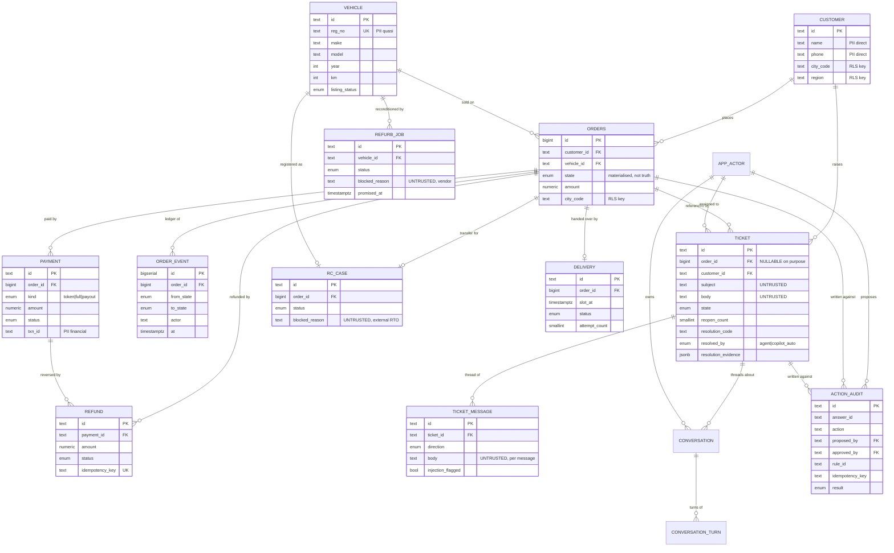
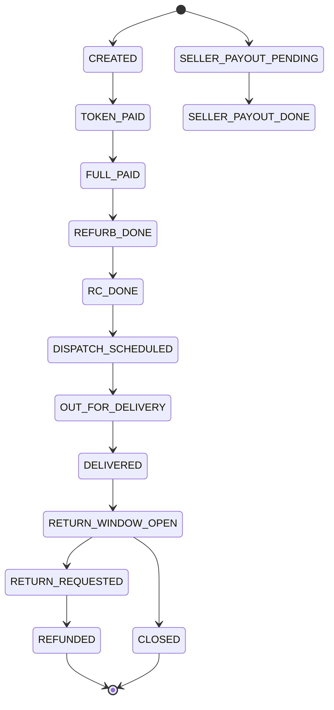
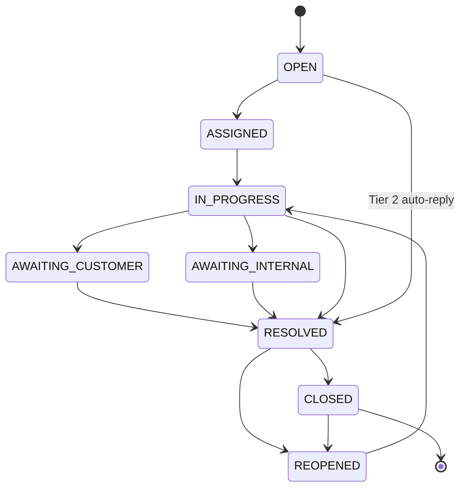
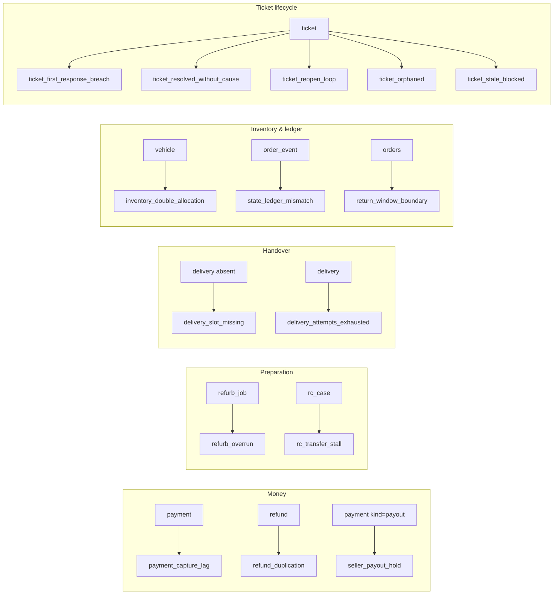
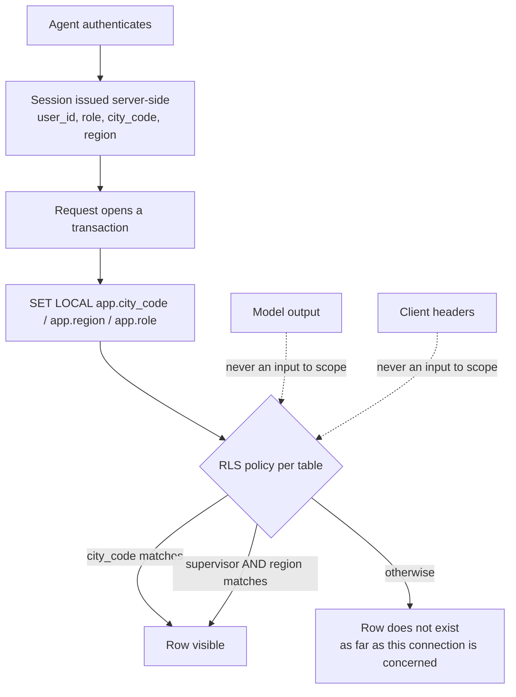
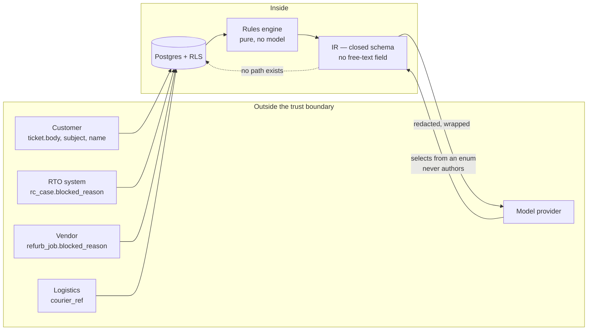

# Data Model — diagrams

Generated against the live schema in `db/init/01_schema.sql`. Every relationship
below is a real foreign key; every state is a real enum value.

Diagrams are Mermaid rather than Excalidraw on purpose: they render inline on
GitHub, they diff line-by-line in review, and they cannot drift from the schema
without someone editing this file. An Excalidraw export is a picture of a
snapshot; this is closer to the snapshot itself.

---

## 1. Entity relationships

Fifteen tables. Twelve are the domain — eleven entities plus the append-only
audit log — and three are operator-side infrastructure: `app_actor`, and the
`conversation` / `conversation_turn` pair.

The split matters when reading the RLS policies below: every one of the fifteen
carries `city_code` and `region` and is covered by the same `city_scope` policy,
but only the conversation pair grants `DELETE` to `app_user`. A conversation is
an operator's working notes and is theirs to clear; nothing about the business
is.



### Three properties this shape encodes

**`order_event` is the source of truth, `orders.state` is a cache.** The state
column exists so the queue does not need a `LATERAL` join per row. When the two
disagree that is a real defect — `state_ledger_mismatch` — and it is seeded
exactly once so the rule has something to find.

**Three units of reference that do not line up.** An `order` is a transaction, a
`vehicle` has a life across many orders, a `ticket` is the unit of work and may
have no order at all. `ticket.order_id` is nullable because customers write "my
Swift hasn't arrived" with no order number, which is why entity resolution is a
feature rather than a bolt-on.

**`refurb_job` hangs off the vehicle, not the order.** That is what lets
reconditioning block a sale that has already been paid for.

---

## 2. Order state machine



Sell-side is stubbed to two states. That is enough for a buyer's delivery to be
blocked because the seller has not been paid — the `seller_payout_hold` case —
without building a second funnel.

Every state declares invariants. `FULL_PAID` implies the payment captured, the
refurb completed, and the RC case done within SLA of capture. Diagnosis is the
diff between what the records imply and what the column says.

---

## 3. Ticket lifecycle



`resolved_by` is an enum (`agent` | `copilot_auto`) and never blank. A CHECK
constraint requires a `resolution_code` on any resolved or closed row, and
resolving without `resolution_evidence` is itself a detectable defect —
`ticket_resolved_without_cause`. A reopened ticket is force-assigned to a human;
auto-reply never gets a second attempt.

---

## 4. Where the rules attach

Each of the 15 rules watches a specific relationship. This is the rules engine's
spec, drawn against the entities rather than listed.



Rules are ranked by causal depth before being returned, so a cause always
outranks its symptom. On order 3110 both `refurb_overrun` and
`delivery_slot_missing` fire; the refurb is the cause and the missing slot
follows from it, so the refurb is reported as `primary_rule`.

---

## 5. Row-level security

Every scoped table carries `city_code` and `region`, denormalised so one policy
shape works everywhere.



`SET LOCAL`, not `SET` — a connection pool plus `SET` silently carries one
request's scope into the next, and that is the detail most likely to be got
wrong. The application connects as `app_user`, which owns nothing: RLS is
bypassed by table owners and superusers, so connecting as either would make
every isolation test pass for the wrong reason.

The failure mode inverts. A forgotten filter returns **zero** rows instead of
everyone's rows — an obvious break rather than a silent leak.

Verify it:

```sql
SET LOCAL app.city_code = 'mum';
SET LOCAL app.role      = 'l1_agent';
SELECT * FROM assert_rls_isolation();   -- all three checks must be 0 / true
```

---

## 6. Trust boundaries

Which fields are attacker-controlled, and where the model sits.



The model is untrusted input, not a security boundary and never a principal. It
selects an action from an enum the rules engine produced for this specific
state; it cannot name an action that is not in that list, cannot invent
parameters, and cannot reach a mutation because no code path runs from `/ask` to
a write.

That structural property is why detection is not load-bearing. A missed
injection is survivable by construction, so the shield icon in the queue is
telemetry rather than a control.

---

## 7. PII classification

Carried as column comments in `01_schema.sql`, so the classification lives with
the column rather than in a document that drifts.

| Class | Examples | Handling |
|---|---|---|
| Direct identifier | `customer.name`, `customer.phone` | Never enters a prompt; pseudonymised at the tool boundary |
| Quasi-identifier | `vehicle.reg_no` | Pseudonymised by default |
| Financial — passable | `payment.amount` | Passes; policy thresholds need it |
| Financial — restricted | `payment.txn_id` | Never passes |
| Free text | `ticket.body`, `ticket_message.body` | Scrubbed before prompt entry. Highest risk |
| Operational | order id, state, timestamps, `blocked_reason` | Passes freely — this is what diagnosis runs on |

The observation this rests on: **diagnosis does not need PII.** "Order 1289 is
FULL_PAID, 62h stale, rc_case blocked on seller_noc_missing" is a complete input
for the rules engine and the phrasing layer. The customer's name adds nothing to
the reasoning and everything to the exposure. Identity fields are rehydrated in
the UI from the database, keyed by id, and never round-trip through a model.
