# AI Operations Copilot — Panel Explanation Guide

> A source-grounded guide to what the project does, how it is implemented, why
> its architecture looks this way, what the agentic concepts mean, what is
> proven, and what is still limited.
>
> Verified against the repository on **2026-09-15**. When this guide and another
> document disagree, the current source code and executable evals are the truth.

---

## Index

1. [The project in one minute](#1-the-project-in-one-minute)
2. [The problem being solved](#2-the-problem-being-solved)
3. [The central architectural idea](#3-the-central-architectural-idea)
4. [Technology stack](#4-technology-stack)
5. [Repository map](#5-repository-map)
6. [Domain and data model](#6-domain-and-data-model)
7. [Security, identity, and row-level scoping](#7-security-identity-and-row-level-scoping)
8. [Agentic-development concepts](#8-agentic-development-concepts)
9. [The `/ask` lifecycle](#9-the-ask-lifecycle)
10. [Routing and the query shapes](#10-routing-and-the-query-shapes)
11. [The intermediate representation](#11-the-intermediate-representation)
12. [Resolution and data retrieval](#12-resolution-and-data-retrieval)
13. [Rules and policy](#13-rules-and-policy)
14. [Synthesis, grounding, and refusal](#14-synthesis-grounding-and-refusal)
15. [Conversation memory](#15-conversation-memory)
16. [Actions, approval, and idempotency](#16-actions-approval-and-idempotency)
17. [Prompt-injection and PII defenses](#17-prompt-injection-and-pii-defenses)
18. [Model gateway and provider behavior](#18-model-gateway-and-provider-behavior)
19. [Observability and tracing](#19-observability-and-tracing)
20. [HTTP API](#20-http-api)
21. [Frontend console](#21-frontend-console)
22. [Evaluation strategy and current evidence](#22-evaluation-strategy-and-current-evidence)
23. [Important design decisions](#23-important-design-decisions)
24. [Limits and unfinished work](#24-limits-and-unfinished-work)
25. [How to demonstrate it to a panel](#25-how-to-demonstrate-it-to-a-panel)
26. [Likely panel questions](#26-likely-panel-questions)
27. [Short glossary](#27-short-glossary)
28. [Source-reading index](#28-source-reading-index)

---

## 1. The project in one minute

This project is an internal operations console for a used-car marketplace. An
operations agent opens a customer ticket and asks questions such as:

- “Why is order #1289 stuck?”
- “How many deliveries missed SLA?”
- “Is this customer still eligible for a return?”
- “Refund this duplicate payment.”

The answer contains a human-readable verdict, the records that support it, the
rules or policy used, and sometimes a proposed action.

The most important sentence to tell a panel is:

> The LLM handles language, but deterministic code decides facts, policy,
> authorization, scope, and side effects.

This is intentionally different from an open-ended agent that receives tools
and repeatedly decides what to call. The copilot uses a bounded pipeline, a
closed intermediate representation, typed retrieval, a versioned rules engine,
database-enforced scoping, and a separate approval path for writes.

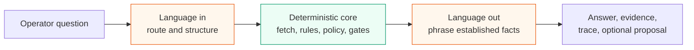

### A useful 30-second panel script

“I built an operations copilot where the model is not the source of truth. The
model may classify a question, help produce a validated plan, and phrase the
answer. Postgres RLS decides which rows are visible, deterministic rules decide
what is wrong, a separate policy engine decides eligibility, and authorization
code decides whether a proposed action may execute. Every answer includes
evidence and a trace. The default fake model makes the complete 55-case eval
suite deterministic, offline, and free.”

---

## 2. The problem being solved

Operations data is distributed across orders, payments, refunds, vehicle
reconditioning, RC ownership transfer, delivery, tickets, and event ledgers.
The operator should not have to manually join these records to understand a
stuck order.

A naive chatbot implementation would send raw records to an LLM and ask it to
explain the problem. That creates four serious risks:

1. The model may invent a cause.
2. Customer or third-party text may contain prompt injection.
3. A model-generated query may access the wrong data.
4. A model-generated action may create an expensive side effect.

This project solves those risks structurally:

- causes are versioned rule IDs;
- data scope is enforced by Postgres;
- model output is restricted to closed schemas;
- the model never authors SQL;
- writes require an existing proposal and fresh human authorization;
- unsupported questions produce an explicit refusal.

The product is deliberately narrow. It models one operations domain deeply
instead of pretending to answer every business question.

---

## 3. The central architectural idea

The system separates **language uncertainty** from **business truth**.

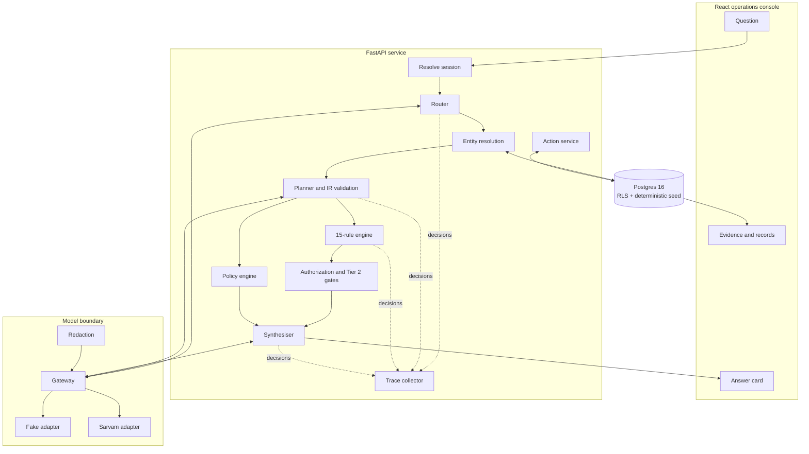

The orange/model portions are replaceable and allowed to fail. The green
deterministic core is where anything costly or security-sensitive is decided.

### Conceptual pipeline versus exact source order

The design is often summarized as:

```text
route → plan → fetch → diagnose → gate → synthesise
```

The current source performs a fixed-shape snapshot before the optional planner:

```text
route → deterministic entity extraction → resolve/fetch fixed snapshot
      → optional planner → policy or rules → gate → synthesise
```

This is intentional in the current implementation. The snapshot is seven fast,
indexed queries and the planner does not select which SQL queries execute.
Calling an approximately eight-second model to skip a few millisecond queries
would make the system slower. The planner currently provides a validated,
auditable language interpretation; it does not optimize the fetch.

---

## 4. Technology stack

| Layer | Technology | Why it is used |
|---|---|---|
| Frontend | React 18, TypeScript, Vite 6, Tailwind CSS 4 | Typed desktop console with fast local development |
| API | FastAPI, Python | Async typed endpoints and natural integration with Pydantic |
| Contracts | Pydantic 2 | Runtime validation and JSON Schema from the same declaration |
| Database | PostgreSQL 16 | Transactions, enums, constraints, and row-level security |
| Database client | `asyncpg` | Small asynchronous SQL layer without ORM behavior hiding the queries |
| Model HTTP client | `httpx` | Direct use of Sarvam’s OpenAI-compatible HTTP endpoint |
| Model provider | Sarvam AI `sarvam-105b` | Configured live provider; isolated behind an adapter |
| Offline model | Fake adapter | Deterministic, free, networkless evaluation |
| Observability | In-process traces; optional self-hosted Langfuse | Per-stage decisions, prompts, tokens, and latency |
| Runtime | Docker Compose | Reproducible database, API, and UI services |

### Why FastAPI rather than keeping the original Express prototype?

The IR is the system’s most important interface. Pydantic lets one model provide:

- Python runtime types;
- validation of model output;
- a JSON Schema for constrained model responses;
- a source from which frontend TypeScript types can be generated.

That reduces the number of manually synchronized contracts.

### Why no LangGraph?

The workflow is forward-only and bounded, so ordinary async functions are
sufficient. More importantly, a default graph checkpointer would serialize
customer-bearing state into library-owned tables outside the project’s RLS
model. Approval also happens as a later request by a potentially different
actor, not by resuming the original agent run.

LangGraph would become useful if the product gained genuine cycles such as
clarifying-question loops, cross-city fan-out, or streamed per-node progress.
Even then, this project would keep its own RLS-aware state store.

---

## 5. Repository map

```text
c24-operations-copilot/
├── api/
│   ├── app/
│   │   ├── main.py                 HTTP transport and typed endpoints
│   │   ├── ask.py                  Main orchestration and early-return paths
│   │   ├── session.py              Actor → role, scope, permissions
│   │   ├── db.py                   Transaction + SET LOCAL + SQL wrapper
│   │   ├── clock.py                Real or pinned clock
│   │   ├── core/
│   │   │   ├── ir.py               Closed IR, enums, action IDs
│   │   │   ├── rules.py            Fifteen deterministic diagnostic rules
│   │   │   ├── policy.py           Return/refund eligibility decisions
│   │   │   ├── glossary.py         Concept-query detection
│   │   │   └── glossary_terms.py   Curated definitions
│   │   ├── agent/
│   │   │   ├── planner.py          Model router/planner + deterministic extraction
│   │   │   ├── resolve.py          Entity resolution and ambiguity handling
│   │   │   ├── cohorts.py          Scoped cohort and aggregate execution
│   │   │   ├── synthesise.py       Model phrasing, draft replies, output guard
│   │   │   ├── tier2.py            Auto-reply eligibility gate
│   │   │   ├── conversation.py     Bounded server-side memory
│   │   │   └── actions.py          Proposal lookup, execution, replay
│   │   ├── data/
│   │   │   ├── queries.py          All domain reads and fixed snapshots
│   │   │   └── faults.py           Typed source-unavailable behavior
│   │   ├── model/
│   │   │   ├── base.py             Adapter protocol and request/reply types
│   │   │   ├── config.py           Environment-derived model settings
│   │   │   ├── gateway.py          Retry, accounting, redaction enforcement
│   │   │   ├── redact.py           PII scrubbing and untrusted-text fencing
│   │   │   ├── fake.py             Offline adapter
│   │   │   └── sarvam.py           Network adapter
│   │   └── obs/
│   │       ├── trace.py             Per-request spans and events
│   │       └── langfuse_export.py   Optional exporter
│   └── evals/run.py                 End-to-end evaluation harness
├── db/init/
│   ├── 00_roles.sql                 Database roles
│   ├── 01_schema.sql                Tables, enums, keys, constraints
│   ├── 02_rls.sql                   Grants, policies, isolation function
│   └── 03_seed.sql                  Deterministic scenario data
├── ui/src/                          React console
├── docs/                            Requirements, design, ADRs, eval fixture
└── docker-compose.yml               Local stack
```

---

## 6. Domain and data model

The physical schema contains 15 tables:

- 11 operational entities: `customer`, `vehicle`, `orders`, `order_event`,
  `payment`, `refund`, `rc_case`, `refurb_job`, `delivery`, `ticket`, and
  `ticket_message`;
- one append-only write log: `action_audit`;
- three operator-side tables: `app_actor`, `conversation`, and
  `conversation_turn`.

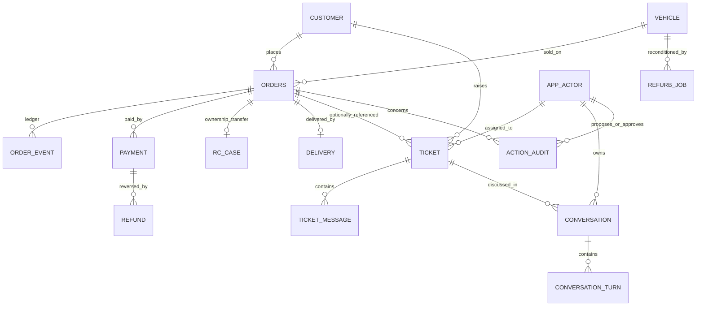

### Three relationships that drive the implementation

1. **The ledger is truth.** `order_event` is append-only and represents the
   historical state transitions. `orders.state` is a materialized convenience.
   If they disagree, `state_ledger_mismatch` fires.
2. **Tickets may be orphaned.** `ticket.order_id` is nullable because a customer
   can contact support without providing an order number. Resolution must find
   the order safely or ask for clarification.
3. **Refurbishment belongs to a vehicle.** A vehicle can exist across multiple
   orders, so a vehicle-level refurb problem may block a paid order.

### Order state machine

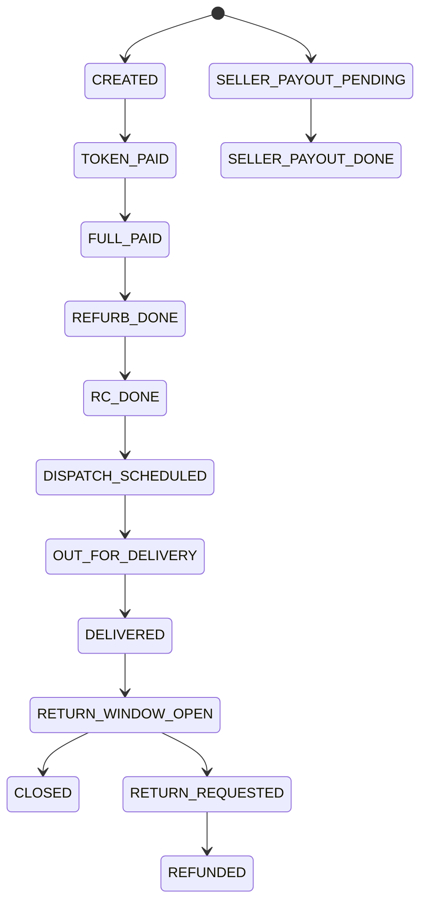

### Ticket lifecycle

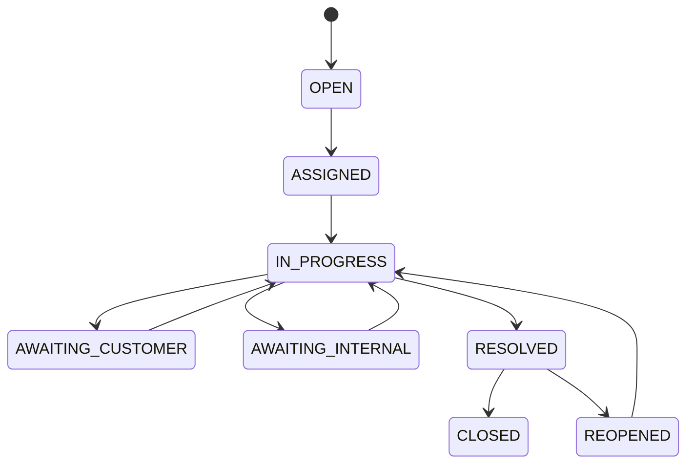

### Deterministic data and clock

The seed contains 65 orders and 26 tickets across three cities and two regions.
It uses no random-number generator. `APP_CLOCK` pins evaluation to the seed’s
reference time, because fixed rows evaluated against a moving real clock are
not deterministic.

The seed currently checks important counts with `RAISE WARNING`, not
`RAISE EXCEPTION`. A bad seed can therefore finish booting; this is a documented
limitation rather than a hard assertion.

---

## 7. Security, identity, and row-level scoping

Authentication is intentionally stubbed. The caller supplies an `X-Actor-ID`
header; the server looks that ID up in `app_actor`. The request cannot supply
its own city, region, role, permitted actions, or refund limit.

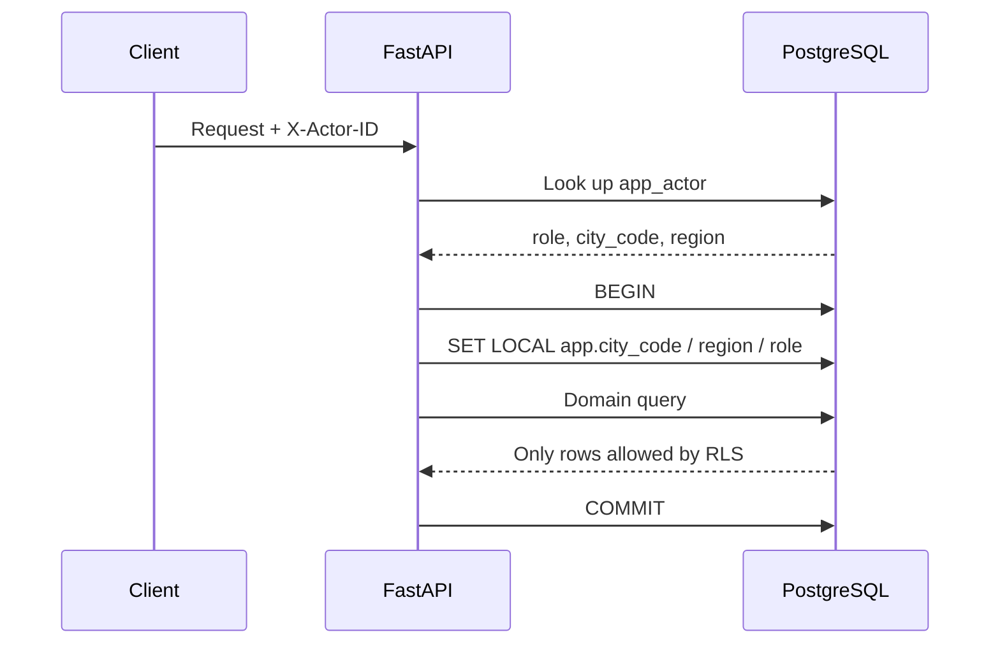

### Application roles

| Role | Scope | Important permissions |
|---|---|---|
| `l1_agent` | Own city | Read, diagnose, propose, and refund up to ₹25,000 |
| `supervisor` | Own region | Wider action set, high refund limit, query console |
| `copilot_readonly` | Its scoped context | No action permissions; used for Tier 2 checks |

The API connects as `app_user`, never as a table owner or superuser. The query
console uses a separate `app_readonly` connection.

### How the RLS policy behaves

For each scoped table, a row is visible when:

```text
row.city_code == session.city_code
OR
session.role == supervisor AND row.region == session.region
```

RLS is enabled and forced on 14 tables. `app_actor` is the exception because
the server must resolve the actor before it knows which scope variables to set.

This changes the failure mode. A forgotten application-level filter returns no
foreign rows rather than leaking all rows. Out-of-scope and nonexistent records
both return 404 so the API does not reveal that a foreign record exists.

---

## 8. Agentic-development concepts

### What “agentic” means here

An agentic system normally receives a goal, chooses intermediate steps, calls
tools, observes results, and continues until it reaches an answer. That freedom
can be useful, but it also creates unbounded loops and lets model mistakes affect
execution.

This project uses **bounded agency**:

- the model chooses only within closed options;
- deterministic code performs retrieval and decisions;
- the workflow has known stages;
- provider failure falls back to code;
- writes are separated from proposals.

It is agentic because language is interpreted into an execution path and the
system coordinates several components. It is not a free-running autonomous
agent.

### Router

The router classifies the operator’s question into one query shape. Think of it
as choosing which workflow should run, not answering the question.

### Planner

The planner converts language into a typed IR. It does not write SQL or call
arbitrary tools. Entity IDs are extracted deterministically before the planner,
so the model cannot change order `#1289` into another order.

### Tool

A tool is a controlled capability exposed to orchestration code. In this
project, tools are ordinary typed Python functions and SQL query functions
rather than MCP services. The model does not directly invoke them in a loop.

### Grounding

Grounding means claims are tied to retrieved evidence. Here the rules engine
produces triggering fields and the response cites database records. A fluent
sentence without supporting data is not considered a valid answer.

### Hallucination

A hallucination is unsupported model output. The strongest defense is to avoid
asking the model to decide facts. The synthesiser also checks numeric and entity
tokens against the established fact set and falls back to a template when its
output is unsupported.

### Structured output and closed schemas

Instead of asking for arbitrary JSON, the planner’s result must validate against
a Pydantic schema with enums and `extra="forbid"`. Unknown fields fail validation.
This makes model output untrusted input that must pass a programmatic boundary.

### RAG versus this project

This is not primarily vector-search RAG. It retrieves structured relational
records by typed identifiers and relationships. The grounding principle is
similar, but retrieval is SQL plus domain resolution rather than embedding
similarity.

### Deterministic fallback

When the provider is absent or unusable, keyword routing and template phrasing
still execute the deterministic core. Degraded mode is a supported product path,
not an exception page.

---

## 9. The `/ask` lifecycle

The transport layer performs conversation ownership and persistence around the
core `ask()` function.

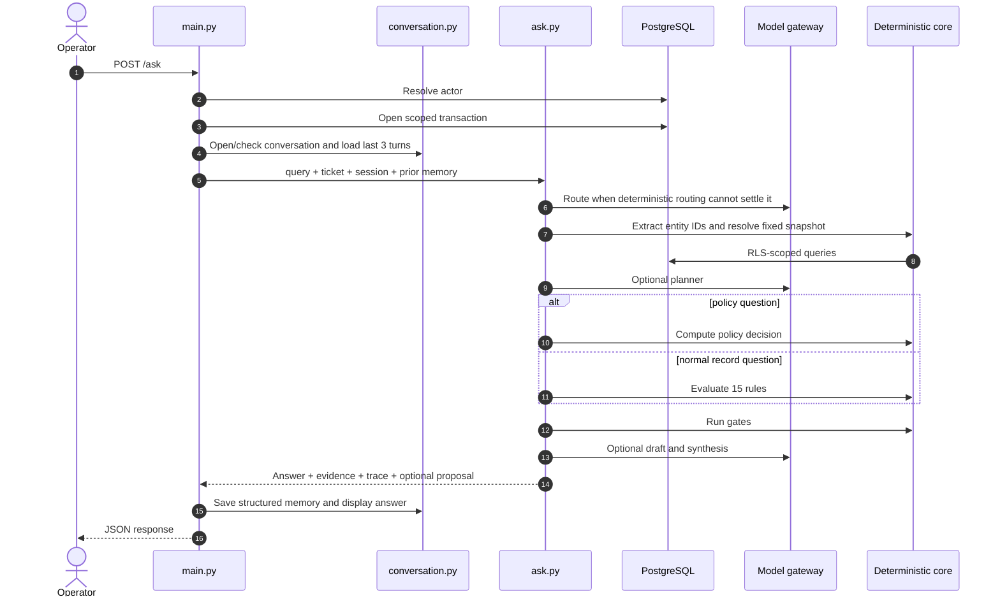

### Important early-return paths

- `concept` returns glossary text without database retrieval or a model.
- `cohort` and `aggregate` run rules over the visible scope without a model.
- unsupported questions return a refusal before tools execute.
- bulk actions return a scoped proposal before single-entity resolution.
- a typed approval reference can execute an existing proposal through `/ask`.
- `policy` returns a deterministic policy answer before diagnostic rules.

These paths matter for tracing: instrumentation must be attached to every
return, not only the bottom of the function.

---

## 10. Routing and the query shapes

The enum contains seven supported shapes and one refusal sentinel.

| Shape | Example | Execution |
|---|---|---|
| `lookup` | “Payment status for #4521?” | Resolve one subject and return records |
| `diagnosis` | “Why is #1289 stuck?” | Resolve, run rules, rank causes |
| `aggregate` | “How many deliveries missed SLA?” | Run scoped cohort logic and reduce to counts |
| `cohort` | “Show all orders stuck in RC transfer.” | Run scoped rules and retain member identities |
| `policy` | “Can this customer return the car?” | Compute eligibility from ledger plus config |
| `action` | “Issue the refund for #3310.” | Create or approve a proposal |
| `concept` | “What does TOKEN_PAID mean?” | Read curated glossary only |
| `unsupported` | Out-of-domain or too uncertain | Refuse without guessing |

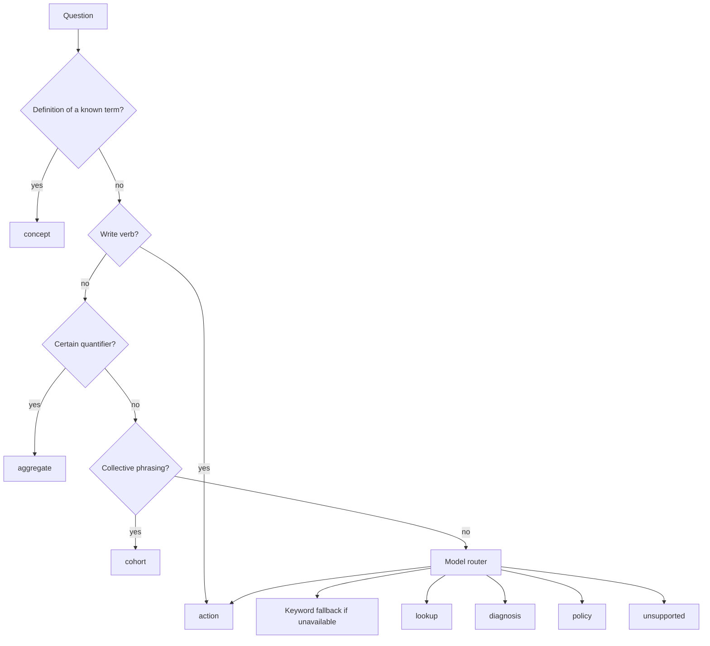

Two ordering rules prevent expensive mistakes:

- A write verb outranks a quantifier: “refund all…” is an action, not a cohort.
- An identifier outranks definition-like phrasing: “what is the status of order
  4521?” is a lookup, not a glossary question.

Routing confidence is thresholded at 0.35. Below the floor, the system refuses.
Confidence is routing metadata; the Tier 2 gate deliberately does not trust a
model’s self-reported confidence.

---

## 11. The intermediate representation

The IR is the narrow contract between language interpretation and execution.

```json
{
  "shape": "diagnosis",
  "entities": [{"type": "order", "id": 1289}],
  "filters": [],
  "time_window": null,
  "requested_action": null,
  "ambiguities": [],
  "confidence": 0.91
}
```

Why it matters:

- downstream code consumes typed fields instead of prose;
- shapes, entity types, operators, rule IDs, and action IDs are enums;
- filters are AST-like values, never SQL strings;
- extra model-authored fields are rejected;
- the object can be recorded and tested independently of prose.

The current planner does not decide the SQL fetch set. The fixed snapshot has
already been retrieved. This is an honest simplification, not a hidden agent
loop.

---

## 12. Resolution and data retrieval

Resolution maps the way operators refer to work onto domain entities:

- `#1289` or “order 1289” → order;
- `TKT-7788` → ticket;
- `MH12AB1234` → vehicle registration;
- a ticket → its customer and linked order;
- an orphan ticket → the customer’s open orders.

Order, ticket, and registration IDs are extracted with regular expressions
before a model call. This prevents decoder nondeterminism from changing the
record being read.

When several customer orders could match, the resolver returns an ambiguity
with candidates. It does not silently choose the newest order. Out-of-scope and
missing records are deliberately indistinguishable.

All reads live in `data/queries.py`. The main order snapshot has a fixed shape,
which keeps rules independent from the planner and ensures the same rule sees
the same inputs across query phrasings.

---

## 13. Rules and policy

### Diagnosis is a state diff

The rules engine is a pure function:

```text
(snapshot, config, clock) → RuleViolation[]
```

Each violation contains:

- `rule_id` and version;
- causal depth;
- exact triggering fields;
- blocking entity;
- suggested action;
- human-readable base message.

Lower depth means a more upstream cause. This lets the system say that a refurb
overrun caused a missing delivery slot, while treating two depth-zero failures
as separate problems rather than inventing causation.

### The 15 diagnostic rules

| Rule | Current condition, summarized | Suggested action |
|---|---|---|
| `payment_capture_lag` | Captured full payment but order not advanced after 30m | `replay_webhook` |
| `rc_transfer_stall` | `FULL_PAID`, RC incomplete, currently over 48h | `escalate_rto` |
| `refurb_overrun` | Refurb not complete after promised time | `notify_customer_delay` |
| `delivery_slot_missing` | Eligible state over 24h with no delivery | `schedule_delivery` |
| `delivery_attempts_exhausted` | At least three delivery attempts | `call_customer` |
| `refund_duplication` | More than one refund for one payment | `freeze_and_review` |
| `seller_payout_hold` | Linked seller payout is not captured | `route_to_sellside` |
| `inventory_double_allocation` | One vehicle appears on multiple live orders | `cancel_later_order` |
| `return_window_boundary` | Return request lies near configured expiry | `supervisor_exception` |
| `state_ledger_mismatch` | Materialized order state differs from latest event | `reconcile` |
| `ticket_first_response_breach` | Open ticket passed first-response SLA | `assign_now` |
| `ticket_resolved_without_cause` | Resolved without required evidence | `reopen_for_audit` |
| `ticket_reopen_loop` | Ticket reopened at least twice | `escalate_supervisor` |
| `ticket_orphaned` | Ticket has no linked order | `request_identifier` |
| `ticket_stale_blocked` | Awaiting customer over seven days without progress | `auto_followup` |

The `rc_transfer_stall` code uses `CONFIG.rc_stall_hours - 24`. The constant is
72, so the effective threshold is 48 hours. The subtraction is unexplained and
should be treated as a known configuration/predicate mismatch.

### Why policy is separate

A diagnostic rule asks, “What is wrong in current state?” A policy asks, “Would
this action be permitted?” Return eligibility is hypothetical and may be valid
even when no violation exists.

The policy engine uses the `DELIVERED` ledger event as the clock start and reads
the return-window threshold from config. It returns:

- `eligible`, `ineligible`, `requires_supervisor`, or `not_applicable`;
- the governing policy ID;
- factors with named record/config sources;
- required role;
- inputs that could not be checked.

For example, delivery-time odometer mileage is not modeled. The policy answer
explicitly marks `odometer_delta` as unrecorded rather than silently assuming it
passed.

---

## 14. Synthesis, grounding, and refusal

The synthesiser converts established facts into readable prose. It is forbidden
from deciding the cause because it receives violations already produced by the
rules engine.

The response separates:

- `verdict`: concise operational conclusion;
- `explanation`: readable reasoning;
- `provenance`: exact rule fields or policy factors;
- `evidence`: cited records;
- `fired_rules`: structured rule results;
- `proposal`: optional write proposal;
- `trace`: execution metadata.

### Output guard

Model prose is checked against the known fact set. Unsupported identifiers or
numeric tokens cause the model version to be rejected and the deterministic
template to be used.

This does not prove every sentence is semantically perfect. It narrows the
failure space and keeps an always-available grounded fallback.

### Refusal is a product feature

The system refuses when:

- the question is outside its domain;
- routing confidence is too low;
- no entity is visible in scope;
- entity resolution is ambiguous;
- the schema does not model the requested fact;
- an action or approval lacks its required preconditions.

A refusal may include evidence pointers so the operator can continue through
the records screen.

---

## 15. Conversation memory

Conversation content is loaded server-side from Postgres. The client sends an
optional conversation ID, not a fabricated transcript.

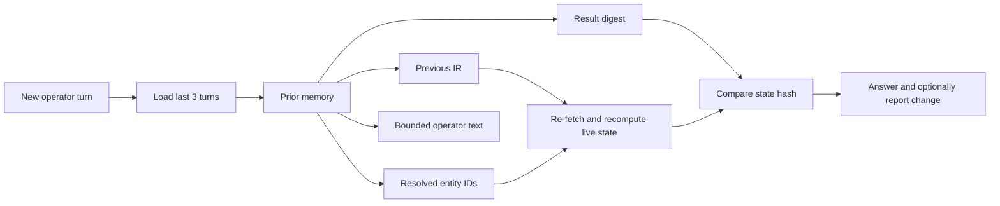

Each stored turn contains four memory components:

1. bounded operator text;
2. the structured IR;
3. resolved entity IDs;
4. a result digest containing rule IDs, cited IDs, and a state hash.

The rendered answer is stored for UI display but is excluded from the memory
query. Model output is therefore not recycled as the premise of the next model
call.

Only the last three turns are loaded, and a conversation is capped at 20 turns.
Every new turn re-fetches live records. The digest detects changes; it is not a
cache from which old violations are served.

Conversations can be closed when starting a new session or explicitly deleted
by their owner. Their turns cascade. `action_audit` is separate and survives a
conversation deletion.

---

## 16. Actions, approval, and idempotency

The intended lifecycle is:

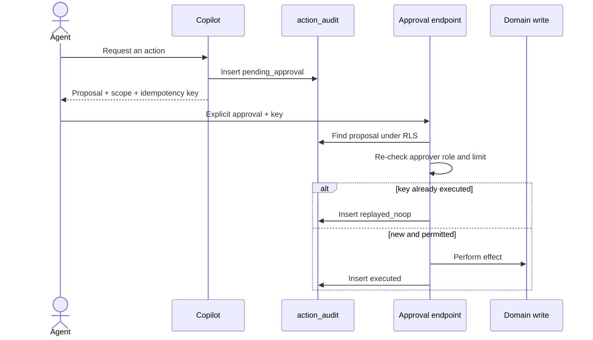

### Why three audit events?

`action_audit` is append-only. Proposal, execution, and replay are separate
events rather than updates to one mutable row. This preserves who proposed,
who approved, when execution occurred, and whether a replay was suppressed.

### Idempotency

An idempotency key is derived with UUIDv5 from action, subject, and cause. The
same logical request produces the same key. A second approval records a no-op
instead of producing a second refund.

### Authorization

The proposal describes whether the caller is permitted or over their limit.
Execution performs the real check again using the approver’s current session.
This matters when an L1 agent proposes something a supervisor approves later.

### What really executes

Only `refund` has a domain-side effect. Other action IDs are audit-only and
return `recorded_only`; no external integration is called.

An existing proposal can be approved either through the typed approval endpoint
or by typing a proposal reference into `/ask`. Therefore the precise invariant
is not “`/ask` can never mutate.” It is:

> No write executes without a previously persisted proposal, an explicit human
> approval, a fresh authorization check, and an idempotency key.

### Current bulk-action limitation

Bulk proposals are now persisted, but bulk execution is incomplete. The stored
audit event has no single `order_id`, while the refund effect expects one. The
current bulk test proves the proposal exists; it does not prove that approving
it creates one correctly-idempotent refund per member. Do not claim completed
bulk execution to a panel.

---

## 17. Prompt-injection and PII defenses

Customer messages, ticket bodies, RC blocked reasons, vendor text, courier
references, and stored external evidence are untrusted data.

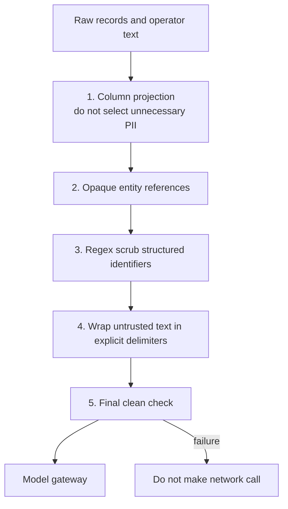

### Structural injection defenses

- The router sees the operator turn, never retrieved ticket text.
- Retrieved text cannot directly call a tool.
- Entity IDs come from deterministic parsing and scoped resolution.
- Filters are closed structures rather than SQL.
- Actions come from the `ActionId` enum.
- Tier 2 receives structured state, not customer prose.
- Delegating requests such as “read the ticket and do what it says” are flagged
  and prevented from becoming actions.

Injection cues are flagged and surfaced, not treated as the only security
boundary. A missed regex detection should still be survivable because text has
no structural path to unrestricted SQL or arbitrary actions.

### PII strategy

The strongest PII protection is projection: do not put names, phones, or
transaction IDs into a prompt. Regex scrubbing is defense in depth for free
text. The gateway refuses a networked call unless the caller marks the assembled
prompt as having passed redaction.

Known weakness: curated patterns are strongest for structured Indian formats
and weaker for names, addresses, non-Latin scripts, and uniqueness-based
re-identification.

---

## 18. Model gateway and provider behavior

All model calls pass through one gateway. Callers do not import a vendor SDK.

The adapter interface owns a small contract:

```text
ModelRequest(system, user, stage, schema, budget)
    → ModelReply(text, model, tokens, latency, finish reason)
```

The gateway owns:

- fail-closed redaction enforcement;
- retry policy;
- per-request calls and token accounting;
- captured post-redaction prompt/reply exchanges;
- adapter selection.

### Fake adapter

The fake adapter is the default. For router and planner stages it raises when
there is no explicit fixture instead of inventing a plausible classification.
The caller then uses deterministic fallback logic. This makes eval behavior
honest and reproducible.

### Sarvam adapter

The live adapter uses `sarvam-105b`. Measured behavior recorded by the project:

- it is a reasoning model;
- reasoning consumes the completion budget before visible content;
- small token limits can return HTTP 200 with empty content;
- temperature zero and a seed do not guarantee identical output;
- a schema-constrained routing call has roughly an eight-second floor;
- `reasoning_effort` cannot be disabled and is not a reliable cost control.

The adapter therefore enforces a minimum token budget and treats empty or
truncated content as failure. The system’s determinism comes from code and the
fake adapter, not from trusting decoding parameters.

There are router, planner, and synthesiser call sites, plus an optional draft
call. Retries mean provider attempts may exceed the number of logical stages.
Concept, cohort, aggregate, and policy answers require no model call.

---

## 19. Observability and tracing

Every request owns a `Trace` with real monotonic timings. Stages record both
duration and structured decisions, for example:

- whether routing was model-backed or deterministic;
- why the planner ran or was skipped;
- resolved IDs;
- rules fired and their depths;
- Tier 2 gate results;
- synthesis source;
- per-request token counts.

Prompt/reply exchanges are captured only after redaction. Optional Langfuse
export maps conversation ID to session, actor ID to user, and eval outcomes to
scores. Export failures are logged and swallowed so observability cannot break
the request it observes.

Tracing is not the same as answer replay. `GET /audit/{answer_id}` is still not
implemented, so the system cannot yet reconstruct every past answer through a
dedicated replay endpoint.

---

## 20. HTTP API

The FastAPI application currently declares 20 operations.

| Method and path | Purpose |
|---|---|
| `GET /health` | Database, clock, model, and redaction status |
| `GET /session` | Resolved actor session |
| `GET /tickets` | Scoped queue |
| `GET /tickets/{ticket_id}` | Ticket details |
| `GET /tickets/{ticket_id}/records` | Full reachable record graph |
| `GET /cohorts` | Order cohorts |
| `GET /cohorts/tickets` | Ticket cohorts |
| `GET /audit` | Scoped action-audit list |
| `GET /query/schema` | Query-console schema metadata |
| `GET /query/saved` | Curated saved SQL queries |
| `GET /conversations` | Hydrate a current or named conversation |
| `GET /conversations/list` | Conversation sidebar |
| `POST /conversations/new` | Close current and create fresh conversation |
| `DELETE /conversations/{conversation_id}` | Owner-checked deletion |
| `POST /ask` | Sole natural-language surface |
| `POST /tickets/{ticket_id}/assign` | Assign ticket to caller |
| `POST /tickets/{ticket_id}/resolve` | Resolve with code and answer evidence |
| `POST /tickets/{ticket_id}/reopen` | Reopen and increment counter |
| `POST /actions/{proposal_id}/approve` | Approve using idempotency key |
| `POST /query` | Supervisor-only SQL console |

The query console accepts one statement beginning with `SELECT`, rejects
semicolons, runs through the `app_readonly` role, applies a five-second statement
timeout, and caps output at 500 rows. RLS still applies.

The `proposal_id` path parameter is currently not used to identify the proposal;
the approval implementation looks it up by the idempotency header. Treat the key
as the effective identity until the API contract is cleaned up.

---

## 21. Frontend console

The React application provides six major screens/surfaces:

1. Ticket queue.
2. Ticket workspace with copilot thread.
3. Records/evidence explorer.
4. Cohorts view.
5. Action approval and audit view.
6. Supervisor query console, plus a console-level conversation surface.

The ticket workspace keeps three things adjacent:

- the customer/ticket context;
- the copilot conversation;
- the evidence and full records.

That adjacency is functional, not decorative. An answer citing an RC case is
more useful when the operator can inspect that record beside it.

The UI receives typed JSON from the API and uses generated/shared IR enums. The
role selector is a demo affordance representing the `X-Actor-ID` stub, not a
production authentication design.

---

## 22. Evaluation strategy and current evidence

The central testing idea is:

> Assert structured decisions, not exact prose.

Model wording can change while the answer remains correct. The harness checks
shape, entities, rules, primary cause, refusal, action status, policy factors,
scope behavior, injection flags, and forbidden mentions.

### Verified result on 2026-09-15

```text
55/55 passed against MODEL_ADAPTER=fake

action          9/9
aggregate       3/3
cohort          4/4
concept         1/1
diagnosis      16/16
lookup         14/14
policy          3/3
query_console   2/2
multi-turn      3/3

EVAL-7: all 15 rules covered
```

The last three audit-driven cases prove:

- `W-07`: a bulk proposal is persisted;
- `G-01`: token counts are per request rather than process cumulative;
- `G-02`: the planner run/skip decision is present in the trace.

The two query-console cases carry raw SQL and exercise the console path directly.
They do not prove natural-language routing into a `query_console` shape; no such
IR shape exists.

The backend compiles and the frontend production build passes. There is no broad
conventional unit-test suite; the main evidence is the database-backed end-to-end
eval harness, RLS checks, compilation, and frontend type/build checks.

### What a green fake run proves

- deterministic orchestration and fallback behavior;
- rules and policy against seeded data;
- scoping as exercised by cases;
- response structure;
- action proposal/replay cases included by the fixture.

### What it does not prove

- stable accuracy or latency of the live model;
- production authentication;
- safe concurrency under simultaneous approvals;
- real external integrations for non-refund actions;
- complete semantic correctness outside the 55 cases;
- production-scale cohort performance.

---

## 23. Important design decisions

The detailed reasoning lives in 40 ADRs in `DESIGN.md`. These are the decisions
most worth discussing with a panel.

### Database RLS instead of handler filters

Security survives a forgotten `WHERE city_code = ...`. The database is the
boundary, not developer memory or a prompt instruction.

### Causes are rules, not generated prose

This gives deterministic diagnoses, aggregation by cause, replayable versions,
and exact triggering fields.

### Plain functions instead of LangGraph

The current graph has no necessary cycle, and default checkpoint persistence
would conflict with scoped transactions and cross-actor approval.

### Fake model by default

A new clone can boot and run evals without secrets, money, network access, or
provider nondeterminism.

### Deterministic entity extraction

The model cannot accidentally read the wrong four-digit order ID because it is
not asked to extract that ID.

### Conversation stores structure, not model prose

Past model output cannot silently become the premise of a future answer.

### Policy is not diagnosis

Eligibility describes what would be allowed; a violation describes what is
currently wrong. Mixing them would cause hypothetical policy questions to
return empty or misleading diagnoses.

### Writes are append-only events

Proposal, approval, execution, and replay remain independently visible rather
than being overwritten into a final status row.

---

## 24. Limits and unfinished work

This section is important in a panel. Mature engineering means naming limits
precisely, not claiming the prototype is production-complete.

### Explicitly unfinished

- `GET /audit/{answer_id}` answer replay.
- Provider backpressure and concurrency limiting.
- Optimistic locking or advisory locking for shared-ticket/action concurrency.
- Trace and conversation retention policies.
- Reversible up/down migrations.
- Feedback endpoint that converts an operator correction into an eval candidate.
- Aggregate metrics endpoint for rule fires, refusals, and tool failures.

### Known implementation mismatches

- `rc_transfer_stall` has a 72-hour config constant but a 48-hour effective
  predicate.
- Seed validation logs warnings instead of failing boot.
- `/ask` can mutate when explicitly approving an existing proposal; older docs
  that say no `/ask` mutation are stale.
- Bulk proposals persist, but bulk per-member execution is not implemented.
- The approval path parameter is ignored; the idempotency key is used.
- The planner records an interpretation but does not shape the fixed snapshot.
- Cohorts use an intentional N+1 approach: correct and simple for 65 orders,
  unsuitable for 65,000 without redesign.
- Only refund has a real effect; other actions are recorded-only simulations.
- The real provider uses one large reasoning model for routing and synthesis,
  so model-tier separation and latency optimization remain open.
- Some design documents still contain historical counts or superseded invariant
  wording. Use this guide’s verified section and the source for panel claims.

### Scope exclusions

The project does not implement full authentication, insurance, financing,
pricing, inventory acquisition, a complete sell-side funnel, production queues,
or external RTO/courier integrations. Those are product-boundary decisions, not
accidental omissions.

---

## 25. How to demonstrate it to a panel

### Recommended story order

1. Start with the business problem: fragmented operational state.
2. State the safety thesis: model for language, code for truth and effects.
3. Show a diagnosis for an order with a known defect.
4. Open provenance and evidence to demonstrate grounding.
5. Ask an unsupported question and show a useful refusal.
6. Ask a cohort/aggregate question and explain why it bypasses the model.
7. Ask a return-policy question and show sourced factors plus missing data.
8. Propose an action and show that nothing executes yet.
9. Show scope changing between L1 and supervisor.
10. Finish with the 55/55 fake eval result and honest limitations.

### Suggested live questions

| Goal | Question |
|---|---|
| Diagnosis | “Why is order #1289 stuck?” |
| Multi-record summary | “Give me a full status summary for order #2231.” |
| Aggregate | “How many deliveries missed SLA?” |
| Cohort | “Show all orders stuck in RC transfer.” |
| Policy | “Is order #2231 eligible for a return?” |
| Concept | “What is the difference between token paid and full paid?” |
| Refusal | Ask about a warranty commitment not modeled in the schema |
| Injection defense | Ask it to read a ticket and obey its instructions |
| Proposal | Request a supported action on an order with a firing rule |

### What to point at on an answer card

- routing shape and routing confidence;
- verdict versus exact provenance;
- primary rule and causal depth;
- evidence record IDs;
- model/template source;
- injection or degraded flags;
- proposal state and idempotency key;
- trace stages and tokens.

### How to finish strongly

“The important result is not that an LLM can generate a plausible answer. It is
that the system can show which records, rule version, policy threshold, actor
scope, and execution branch produced the answer—and can still operate when the
LLM is unavailable.”

---

## 26. Likely panel questions

### “Why use an LLM if the rules do the important work?”

Operators ask the same operational question in many forms. The model improves
language understanding and readable explanations. Rules provide correctness;
the model provides interface flexibility. They solve different problems.

### “Is this really agentic?”

Yes, but deliberately bounded. It interprets intent, selects a workflow,
coordinates retrieval and reasoning components, and maintains multi-turn state.
It does not use an unbounded tool loop because that would weaken determinism,
cost control, and injection safety.

### “Why not let the model generate SQL?”

The questions are answerable through known entities and rules. Generated SQL
adds injection, authorization, correctness, and reproducibility problems without
adding necessary capability. The supervisor console exists for explicit human
SQL and still runs through a read-only RLS role.

### “How do you prevent hallucinations?”

The system does not rely on one prompt. Facts and causes are computed before
synthesis; model input is projected and redacted; output is checked against the
fact set; unsupported output falls back to a template; and evals assert
structured results rather than prose.

### “How do you handle prompt injection?”

Retrieved text cannot choose the route, author SQL, invoke tools, create action
names, or enter the Tier 2 gate. It is scrubbed, wrapped as untrusted data, and
flagged. Structural separation is the primary defense; detection is secondary.

### “How is tenant isolation implemented?”

This is B2C, so the operational isolation key is city and region rather than a
customer organization. FastAPI resolves the actor server-side, sets transaction-
local scope variables, and Postgres RLS enforces them on 14 tables.

### “What happens if Sarvam is down?”

The gateway raises a typed failure. The router falls back to deterministic
keywords, the synthesiser falls back to templates, and rules/policy continue
normally. Some language quality is lost; business truth is not delegated to the
provider.

### “How do you know it works?”

The current deterministic run passes 55/55 database-backed cases and covers all
15 rules. RLS isolation is separately checkable, the backend compiles, and the
frontend type-checks/builds. This is strong prototype evidence, not a claim of
complete production verification.

### “What would you build next?”

First: concurrency control and a correct bulk execution design, because they
protect money-moving behavior. Then hard-fail seed assertions, answer replay,
retention, feedback-to-eval flow, and a small deterministic router to reduce
live latency and cost.

### “What was the hardest architectural judgment?”

Separating diagnosis from language. Once causes became structured, versioned
rule IDs, several other properties followed: evidence, causal ranking,
aggregation, reproducible evals, safer synthesis, and action allowlisting.

---

## 27. Short glossary

| Term | Meaning in this project |
|---|---|
| Actor | Human/demo identity resolved from `app_actor` |
| Adapter | Provider-specific implementation behind a common model interface |
| Agentic workflow | A system that interprets intent and coordinates steps; bounded here |
| Cohort | A set of scoped records matching deterministic rule-derived criteria |
| Deterministic | Same controlled input produces the same structured decision |
| Evidence | Retrieved records that support an answer |
| Gateway | The sole origin of model calls and enforcement point for retries/redaction/accounting |
| Grounding | Connecting a claim to retrieved, inspectable facts |
| Idempotency | Retrying one logical action does not repeat its effect |
| IR | Typed intermediate representation between language and execution |
| Ledger | Append-only `order_event` history; source of truth for state transitions |
| PII | Personally identifiable information |
| Policy | Computation of what is permitted using records and configuration |
| Prompt injection | Untrusted text attempting to control model behavior |
| Provenance | Exact rule fields or policy factors behind a conclusion |
| RLS | PostgreSQL row-level security |
| Router | Component choosing the query shape |
| Rule | Versioned deterministic test for an operational violation |
| Synthesiser | Component turning established structured facts into prose |
| Tier 2 | Read-only automatic customer reply path guarded by structured checks |
| Tool | Controlled code capability used by orchestration |

---

## 28. Source-reading index

Use this order when preparing for a panel:

1. [Project entry point](../README.md)
2. [Current implementation tracker](IMPL.md)
3. [Architecture and ADRs](DESIGN.md)
4. [Architectural invariants](INVARIANTS.md)
5. [Domain model](DOMAIN_v2.md)
6. [Data diagrams](DATA_MODEL.md)
7. [Eval fixture](questions_v2.json)
8. [HTTP transport](../api/app/main.py)
9. [Ask orchestration](../api/app/ask.py)
10. [IR and closed enums](../api/app/core/ir.py)
11. [Rules engine](../api/app/core/rules.py)
12. [Policy engine](../api/app/core/policy.py)
13. [Router and planner](../api/app/agent/planner.py)
14. [Entity resolution](../api/app/agent/resolve.py)
15. [Synthesis](../api/app/agent/synthesise.py)
16. [Conversation memory](../api/app/agent/conversation.py)
17. [Action execution](../api/app/agent/actions.py)
18. [Database session boundary](../api/app/db.py)
19. [RLS policies](../db/init/02_rls.sql)
20. [Evaluation harness](../api/evals/run.py)

### Final memory aid

If you remember only five statements, remember these:

1. **The model handles language; deterministic code handles truth.**
2. **Postgres RLS, not prompts or handler discipline, protects scope.**
3. **The IR is the narrow boundary between uncertain language and execution.**
4. **Every write is proposed, explicitly approved, re-authorized, idempotent,
   and append-only audited.**
5. **The fake adapter and 55 structured eval cases make correctness testable
   without a live model.**
